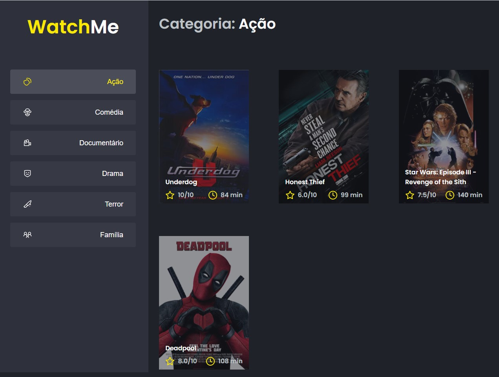

# Ignite WatchMe

This is the result of challenge 02 of Rocketseat's Ignite Acceleration Program.

The challenge was to split the application into at least two main parts: the sidebar and the main content that has the header and movie listing.

As extra work, the header was also componentized.

To install dependencies
# yarn

To run JSON Server to simulate an API that has the genre and movie information
# yarn server

To run the application on localhost:8080
# yarn dev

